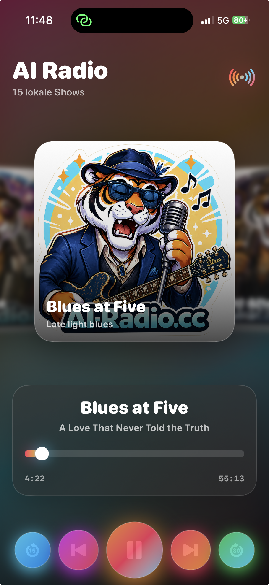

# AI Radio on iPhone

Native SwiftUI-App zum lokalen Abspielen der AI-Radio-Sendungen auf dem iPhone.

Die App ist als visueller Radio-/Show-Player gebaut: oben ein endloses Cover-Carousel, darunter Now-Playing-Anzeige, Scrubbing und grosse farbige Player-Controls. Die Audiodateien werden lokal aus dem App-Dokumentenordner gelesen. Eine Internetverbindung ist fuer die Wiedergabe nicht erforderlich.



## Aktueller Funktionsumfang

- Native iOS-App mit SwiftUI
- Optimiert fuer Portrait und Landscape auf aktuellen iPhones
- Endloses Cover-Carousel mit geblurrten Nachbar-Covern
- Lokale Wiedergabe mit `AVAudioPlayer`
- Play/Pause, Stop, 15 Sekunden zurueck, 30 Sekunden vor
- Next/Before springen innerhalb der aktuellen Show zum naechsten/vorigen Track
- Wechsel der Show ueber die Cover-Bilder
- Zuletzt ausgewaehlte Show wird beim Neustart wieder vorne im Carousel angezeigt
- Live-Fortschritt mit Scrubbing
- Automatischer Wechsel zum naechsten Track innerhalb einer Show
- Background-Audio im Ruhemodus
- Now-Playing-Daten mit Cover fuer Sperrbildschirm, Control Center und StandBy/Laden
- On-Air-Symbol: einfarbig im Stopp/Pause-Zustand, langsam animierter Farbverlauf waehrend der Wiedergabe
- App-Icon im Asset Catalog

## Lokale Medienstruktur

Die App erwartet die Sendungen im App-Dokumentenordner auf dem iPhone:

```text
Documents/
  10_AI_Radio_Exports/
    01-b - Weltklang/
      00_Playlist.m3u
      ...
    02-a - Pure Metal/
      00_Playlist.m3u
      ...
```

Jede Show wird ueber `ShowItem.swift` einer lokalen Playlist zugeordnet:

```swift
ShowItem(
    id: "open-road-country",
    title: "Open Road Country",
    subtitle: "Wide road stories",
    coverImageName: "cover_country",
    folderName: "03-a - Open Road Country",
    playlistFileName: "00_Playlist.m3u",
    audioFileName: nil,
    durationHint: nil,
    description: "Country scenes built for long drives."
)
```

Neue Shows werden in `ShowItem.examples` ergaenzt. Wichtig sind:

- `coverImageName`: Name des Bildes im Asset Catalog
- `folderName`: Ordnername unter `Documents/10_AI_Radio_Exports`
- `playlistFileName`: normalerweise `00_Playlist.m3u`

## Cover und App-Icon

Die Show-Cover liegen im Asset Catalog:

```text
AI Radio Sendung auf Iphone/
  Assets.xcassets/
    cover_balkan_disco.imageset/
    cover_blues.imageset/
    cover_country.imageset/
    ...
```

Das App-Icon liegt in:

```text
Assets.xcassets/AppIcon.appiconset/
```

Das urspruengliche Icon-Bild wurde zusaetzlich als Referenz in `IphoneOriginal.imageset` abgelegt.

## Code-Struktur

- `AI_Radio_Sendung_auf_IphoneApp.swift`: App-Einstieg
- `ContentView.swift`: responsive Portrait-/Landscape-Komposition
- `ShowItem.swift`: Datenmodell und Show-Liste
- `AudioPlayerViewModel.swift`: Audio, Playlists, Remote Commands, Now Playing
- `CarouselView.swift`: Cover-Carousel mit Endlos-Loop und Swipe-Gesten
- `NowPlayingView.swift`: Titel, Track, Fortschritt und Scrubbing
- `PlayerControlsView.swift`: farbige Player-Controls
- `Info.plist`: iOS-Metadaten, Background-Audio, Orientierungen

## Build

Projekt in Xcode oeffnen:

```text
AI Radio Sendung auf Iphone.xcodeproj
```

Oder per Terminal bauen:

```bash
xcodebuild \
  -project "AI Radio Sendung auf Iphone.xcodeproj" \
  -scheme "AI Radio Sendung auf Iphone" \
  -configuration Debug \
  -destination "generic/platform=iOS" \
  CODE_SIGN_STYLE=Automatic \
  build
```

Fuer Installation und Test auf einem angeschlossenen iPhone kann statt `generic/platform=iOS` die konkrete Device-ID als Destination verwendet werden.

## Hinweise zur Erweiterung

1. Neue Audiodateien auf das iPhone in `Documents/10_AI_Radio_Exports/<Show-Ordner>` kopieren.
2. Im Show-Ordner eine `00_Playlist.m3u` bereitstellen.
3. Neues Cover in `Assets.xcassets` ablegen.
4. Einen neuen Eintrag in `ShowItem.examples` anlegen.

Die Player-Buttons `Next` und `Before` springen absichtlich zwischen Tracks innerhalb der aktuellen Show. Der Wechsel zwischen Shows erfolgt ueber das Carousel.

## UI-Verhalten

Die App speichert die zuletzt ausgewaehlte Show lokal mit `UserDefaults`. Beim naechsten Start wird diese Show wieder als zentrale Carousel-Karte geladen. Gespeichert wird die stabile `ShowItem.id`; der Index dient nur als Fallback.

Das On-Air-Symbol rechts im Header ist an den Wiedergabestatus gekoppelt:

- Wiedergabe aktiv: langsamer wandernder Farbverlauf mit dezentem Glow
- Pause/Stopp: einfarbig gedimmt
